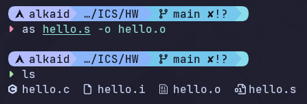

## 4.1 汇编的概念和作用

汇编是将汇编代码（通常以.s为后缀）转换为目标文件（通常以.o为后缀）的过程，汇编器会将汇编指令转换为机器码，并生成包含符号表和重定位信息的目标文件

汇编的主要作用包括：

1. 指令转换：将汇编指令转换为机器码，生成可执行的二进制代码
2. 符号管理：生成符号表，记录变量和函数的地址信息，便于链接器进行符号解析
3. 重定位支持：生成重定位信息，支持链接器将目标文件中的代码和数据正确地放置在最终的可执行文件中

## 4.2 汇编命令

```shell
as hello.s -o hello.o
```



## 4.3 可重定位目标elf格式

### 文件头

```shell
readelf -S hello.o
```

```plaintext
There are 14 section headers, starting at offset 0x438:

节头：
  [号] 名称              类型             地址              偏移量
       大小              全体大小          旗标   链接   信息   对齐
  [ 0]                   NULL             0000000000000000  00000000
       0000000000000000  0000000000000000           0     0     0
  [ 1] .text             PROGBITS         0000000000000000  00000040
       000000000000009c  0000000000000000  AX       0     0     1
  [ 2] .rela.text        RELA             0000000000000000  000002e8
       00000000000000c0  0000000000000018   I      11     1     8
  [ 3] .data             PROGBITS         0000000000000000  000000dc
       0000000000000000  0000000000000000  WA       0     0     1
  [ 4] .bss              NOBITS           0000000000000000  000000dc
       0000000000000000  0000000000000000  WA       0     0     1
  [ 5] .rodata           PROGBITS         0000000000000000  000000e0
       0000000000000040  0000000000000000   A       0     0     8
  [ 6] .comment          PROGBITS         0000000000000000  00000120
       000000000000001c  0000000000000001  MS       0     0     1
  [ 7] .note.GNU-stack   PROGBITS         0000000000000000  0000013c
       0000000000000000  0000000000000000           0     0     1
  [ 8] .note.gnu.pr[...] NOTE             0000000000000000  00000140
       0000000000000030  0000000000000000   A       0     0     8
  [ 9] .eh_frame         PROGBITS         0000000000000000  00000170
       0000000000000038  0000000000000000   A       0     0     8
  [10] .rela.eh_frame    RELA             0000000000000000  000003a8
       0000000000000018  0000000000000018   I      11     9     8
  [11] .symtab           SYMTAB           0000000000000000  000001a8
       0000000000000108  0000000000000018          12     4     8
  [12] .strtab           STRTAB           0000000000000000  000002b0
       0000000000000032  0000000000000000           0     0     1
  [13] .shstrtab         STRTAB           0000000000000000  000003c0
       0000000000000074  0000000000000000           0     0     1
Key to Flags:
  W (write), A (alloc), X (execute), M (merge), S (strings), I (info),
  L (link order), O (extra OS processing required), G (group), T (TLS),
  C (compressed), x (unknown), o (OS specific), E (exclude),
  D (mbind), l (large), p (processor specific)
  ```

- 代码节 (.text) 和数据节 (.rodata):
  - .text 节（[ 1]）包含了 main 函数的机器指令，大小为0x9c 字节，旗标是 AX (可执行，可分配)
  - .rodata 节（[ 5]）包含了字符串常量（例如程序中的提示信息和格式字符串），旗标是 A (可分配)，但没有 W 旗标，说明它是只读数据
  - .data 和 .bss 节大小都为零，说明程序中没有初始化或未初始化的全局变量

- 重定位节 (.rela.text):
  - .rela.text 节（[ 2]）专门用于记录对 .text 节中的代码指令的修正信息。由于代码调用了 printf、exit、sleep 等外部函数，这些调用地址在编译时是未知的，因此需要大量的重定位项
  - 另一个重定位节是 .rela.eh_frame（[10]），用于栈展开信息的修正

### 符号表

```shell
readelf -s hello.o
```

```plaintext
Symbol table '.symtab' contains 11 entries:
   Num:    Value          Size Type    Bind   Vis      Ndx Name
     0: 0000000000000000     0 NOTYPE  LOCAL  DEFAULT  UND
     1: 0000000000000000     0 FILE    LOCAL  DEFAULT  ABS hello.i
     2: 0000000000000000     0 SECTION LOCAL  DEFAULT    1 .text
     3: 0000000000000000     0 SECTION LOCAL  DEFAULT    5 .rodata
     4: 0000000000000000   156 FUNC    GLOBAL DEFAULT    1 main
     5: 0000000000000000     0 NOTYPE  GLOBAL DEFAULT  UND puts
     6: 0000000000000000     0 NOTYPE  GLOBAL DEFAULT  UND exit
     7: 0000000000000000     0 NOTYPE  GLOBAL DEFAULT  UND printf
     8: 0000000000000000     0 NOTYPE  GLOBAL DEFAULT  UND atoi
     9: 0000000000000000     0 NOTYPE  GLOBAL DEFAULT  UND sleep
    10: 0000000000000000     0 NOTYPE  GLOBAL DEFAULT  UND getchar
```

- 已定义符号： 唯一的本地函数`main`被定义，其`Ndx`字段指向`.text`节，`Value`为`0x0`，表示其在节内的偏移量。

- 未定义符号： 所有的外部库函数（`puts`, `exit`,`printf`,`atoi`,`sleep`,`getchar`）的`Ndx`字段都为`UND`，表明它们的绝对地址在编译`hello.o`时是未知的。这些未定义符号构成了`.rela.text`的主要修正目标。

- 编译器优化： 符号表中包含对`puts`的引用，说明GCC对源代码中不含格式化参数的`printf`调用进行了优化，将其替换为对`puts`的调用

### 重定位项目

```shell
readelf -r hello.o
```

```plaintext
重定位节 '.rela.text' at offset 0x2e8 contains 8 entries:
  偏移量          信息           类型           符号值        符号名称 + 加数
000000000018  000300000002 R_X86_64_PC32     0000000000000000 .rodata - 4
000000000020  000500000004 R_X86_64_PLT32    0000000000000000 puts - 4
00000000002a  000600000004 R_X86_64_PLT32    0000000000000000 exit - 4
00000000005b  000300000002 R_X86_64_PC32     0000000000000000 .rodata + 2c
000000000068  000700000004 R_X86_64_PLT32    0000000000000000 printf - 4
00000000007b  000800000004 R_X86_64_PLT32    0000000000000000 atoi - 4
000000000082  000900000004 R_X86_64_PLT32    0000000000000000 sleep - 4
000000000091  000a00000004 R_X86_64_PLT32    0000000000000000 getchar - 4

重定位节 '.rela.eh_frame' at offset 0x3a8 contains 1 entry:
  偏移量          信息           类型           符号值        符号名称 + 加数
000000000020  000200000002 R_X86_64_PC32     0000000000000000 .text + 0
```

#### `.rela.text` 节分析（对代码的修正）

#### 1. 外部函数调用重定位 (PLT32 类型)

这 6 个条目用于修正对所有**外部库函数**的调用地址，这些修正都使用了 `R_X86_64_PLT32` 类型

| 偏移量 | 符号名称 | 类型 | 修正目标 | 意义 |
| :--- | :--- | :--- | :--- | :--- |
| `0x0020` | `puts` | `PLT32` | 代码 | 修正对 `puts` 的调用指令，使其跳转到 PLT 入口。 |
| `0x002a` | `exit` | `PLT32` | 代码 | 修正对 `exit` 的调用指令，使其跳转到 PLT 入口。 |
| `0x0068` | `printf` | `PLT32` | 代码 | 修正对 `printf` 的调用指令，使其跳转到 PLT 入口。 |
| `0x007b` | `atoi` | `PLT32` | 代码 | 修正对 `atoi` 的调用指令，使其跳转到 PLT 入口。 |
| `0x0082` | `sleep` | `PLT32` | 代码 | 修正对 `sleep` 的调用指令，使其跳转到 PLT 入口。 |
| `0x0091` | `getchar` | `PLT32` | 代码 | 修正对 `getchar` 的调用指令，使其跳转到 PLT 入口。 |

- **类型 `R_X86_64_PLT32`：** 这是一种 **PC 相对（PC-relative）** 的重定位。它要求链接器将目标函数（如 `printf`）的 **PLT（Procedure Linkage Table）** 入口地址减去当前指令的地址（PC），并将计算得到的 32 位相对偏移量填入指令的操作数中
- **加数 (`- 4`)：** 在 x86-64 架构中，相对地址计算的基准是指令的**下一条指令**的地址，即 `PC + 4`。这里的 `-4` 已经计入了这种指令长度差异

#### 2. 数据引用重定位 (PC32 类型)

这 2 个条目用于修正代码中对**字符串常量**的引用地址。

| 偏移量 | 符号名称 | 类型 | 修正目标 | 意义 |
| :--- | :--- | :--- | :--- | :--- |
| `0x0018` | `.rodata` | `PC32` | 数据 | 修正代码中对字符串 `"用法: Hello..."` 的引用地址。 |
| `0x005b` | `.rodata` | `PC32` | 数据 | 修正代码中对字符串 `"Hello %s %s %s\n"` 的引用地址。 |

- **类型 `R_X86_64_PC32`：** 同样是 PC 相对寻址。它要求链接器计算目标数据（位于 `.rodata` 节）的地址相对于当前指令地址的偏移量，然后填入指令中
- **符号：** 目标符号是 **`.rodata`** 节本身，表明引用的是节内的某个偏移位置

#### `.rela.eh_frame` 节分析（对元数据的修正）

该节的 1 个条目用于修正异常处理元数据。

- **`0x0020`** 处的重定位修正了 `.eh_frame` 节中指向 **`.text`** 节起始位置的指针。这是为了确保在运行时，异常处理机制能够正确地回溯（unwind）函数调用栈

## 4.4 Hello.o的结果解析

反汇编内容：

```assembly wrap=false
Disassembly of section .text:

0000000000000000 <main>:
   0:   55                      push   %rbp
   1:   48 89 e5                mov    %rsp,%rbp
   4:   48 83 ec 20             sub    $0x20,%rsp
   8:   89 7d ec                mov    %edi,-0x14(%rbp)
   b:   48 89 75 e0             mov    %rsi,-0x20(%rbp)
   f:   83 7d ec 05             cmpl   $0x5,-0x14(%rbp)
  13:   74 19                   je     2e <main+0x2e>
  15:   48 8d 05 00 00 00 00    lea    0x0(%rip),%rax        # 1c <main+0x1c>
                        18: R_X86_64_PC32       .rodata-0x4
  1c:   48 89 c7                mov    %rax,%rdi
  1f:   e8 00 00 00 00          call   24 <main+0x24>
                        20: R_X86_64_PLT32      puts-0x4
  24:   bf 01 00 00 00          mov    $0x1,%edi
  29:   e8 00 00 00 00          call   2e <main+0x2e>
                        2a: R_X86_64_PLT32      exit-0x4
  2e:   c7 45 fc 00 00 00 00    movl   $0x0,-0x4(%rbp)
  35:   eb 53                   jmp    8a <main+0x8a>
  37:   48 8b 45 e0             mov    -0x20(%rbp),%rax
  3b:   48 83 c0 18             add    $0x18,%rax
  3f:   48 8b 08                mov    (%rax),%rcx
  42:   48 8b 45 e0             mov    -0x20(%rbp),%rax
  46:   48 83 c0 10             add    $0x10,%rax
  4a:   48 8b 10                mov    (%rax),%rdx
  4d:   48 8b 45 e0             mov    -0x20(%rbp),%rax
  51:   48 83 c0 08             add    $0x8,%rax
  55:   48 8b 00                mov    (%rax),%rax
  58:   48 8d 3d 00 00 00 00    lea    0x0(%rip),%rdi        # 5f <main+0x5f>
                        5b: R_X86_64_PC32       .rodata+0x2c
  5f:   48 89 c6                mov    %rax,%rsi
  62:   b8 00 00 00 00          mov    $0x0,%eax
  67:   e8 00 00 00 00          call   6c <main+0x6c>
                        68: R_X86_64_PLT32      printf-0x4
  6c:   48 8b 45 e0             mov    -0x20(%rbp),%rax
  70:   48 83 c0 20             add    $0x20,%rax
  74:   48 8b 00                mov    (%rax),%rax
  77:   48 89 c7                mov    %rax,%rdi
  7a:   e8 00 00 00 00          call   7f <main+0x7f>
                        7b: R_X86_64_PLT32      atoi-0x4
  7f:   89 c7                   mov    %eax,%edi
  81:   e8 00 00 00 00          call   86 <main+0x86>
                        82: R_X86_64_PLT32      sleep-0x4
  86:   83 45 fc 01             addl   $0x1,-0x4(%rbp)
  8a:   83 7d fc 09             cmpl   $0x9,-0x4(%rbp)
  8e:   7e a7                   jle    37 <main+0x37>
  90:   e8 00 00 00 00          call   95 <main+0x95>
                        91: R_X86_64_PLT32      getchar-0x4
  95:   b8 00 00 00 00          mov    $0x0,%eax
  9a:   c9                      leave
  9b:   c3                      ret
```

`hello.s`内容：

```assembly wrap=false
        .file   "hello.i"
        .text
        .section        .rodata
        .align 8
.LC0:
        .base64 "55So5rOVOiBIZWxsbyDlrablj7cg5aeT5ZCNIOaJi+acuuWPtyDnp5LmlbDvvIEA"
.LC1:
        .string "Hello %s %s %s\n"
        .text
        .globl  main
        .type   main, @function
main:
.LFB6:
        .cfi_startproc
        pushq   %rbp
        .cfi_def_cfa_offset 16
        .cfi_offset 6, -16
        movq    %rsp, %rbp
        .cfi_def_cfa_register 6
        subq    $32, %rsp
        movl    %edi, -20(%rbp)
        movq    %rsi, -32(%rbp)
        cmpl    $5, -20(%rbp)
        je      .L2
        leaq    .LC0(%rip), %rax
        movq    %rax, %rdi
        call    puts@PLT
        movl    $1, %edi
        call    exit@PLT
.L2:
        movl    $0, -4(%rbp)
        jmp     .L3
.L4:
        movq    -32(%rbp), %rax
        addq    $24, %rax
        movq    (%rax), %rcx
        movq    -32(%rbp), %rax
        addq    $16, %rax
        movq    (%rax), %rdx
        movq    -32(%rbp), %rax
        addq    $8, %rax
        movq    (%rax), %rax
        leaq    .LC1(%rip), %rdi
        movq    %rax, %rsi
        movl    $0, %eax
        call    printf@PLT
        movq    -32(%rbp), %rax
        addq    $32, %rax
        movq    (%rax), %rax
        movq    %rax, %rdi
        call    atoi@PLT
        movl    %eax, %edi
        call    sleep@PLT
        addl    $1, -4(%rbp)
.L3:
        cmpl    $9, -4(%rbp)
        jle     .L4
        call    getchar@PLT
        movl    $0, %eax
        leave
        .cfi_def_cfa 7, 8
        ret
        .cfi_endproc
.LFE6:
        .size   main, .-main
        .ident  "GCC: (GNU) 15.2.1 20251112"
        .section        .note.GNU-stack,"",@progbits
```

可重定位目标文件（`hello.o`）中的机器码和汇编源文件（`hello.s`）中的汇编指令之间存在**多阶段映射关系**。机器语言通过 **PC 相对寻址** 和 **占位符 + 重定位条目** 来解决地址未定问题，这导致了反汇编输出中操作数（特别是目标地址）与原始汇编代码（标签）或最终地址不一致

### 1. 机器语言的构成与基本映射

机器指令由 **操作码（Opcode）**、**寻址模式（ModR/M）** 和 **操作数（Operand）** 构成

| 机器码 (Offset: 1) | 汇编指令 (`hello.o`) | `hello.s` | 构成说明 |
| :--- | :--- | :--- | :--- |
| `48 89 e5` | `mov %rsp,%rbp` | `movq %rsp, %rbp` | **操作码/前缀映射：** `48` 是 REX 前缀（启用 64 位），`89` 是 `mov` 的操作码，`e5` 是 ModR/M 字节（指定了 `%rsp` 和 `%rbp` 寄存器）,这是一个明确的 **一对一映射**|
| `89 7d ec` | `mov %edi,-0x14(%rbp)` | `movl %edi, -20(%rbp)` | **寻址模式：** 机器码中的 `7d ec` 对应栈上的相对地址 `-0x14`。这是将 `argc` (32位) 存入栈帧的指令|

### 2. 分支转移指令分析 (相对寻址)

分支指令（如 `je`, `jle`, `jmp`）的操作数在机器码中是**相对偏移量**，而不是符号或绝对地址。

| Offset | 机器码 | `hello.o` 反汇编 | `hello.s` 标签 | 分析 |
| :--- | :--- | :--- | :--- | :--- |
| `13` | `74 19` | `je 2e <main+0x2e>` | `je .L2` | **内部跳转**：`74` 是 `je` 操作码。操作数 `19` (十进制 25) 是 1 字节的**相对偏移量**。它表示 "从当前指令的下一条指令地址 (PC) 开始，向前跳转 25 字节"。汇编器自动计算并填入了这 25 字节|
| `8e` | `7e a7` | `jle 37 <main+0x37>` | `jle .L4` | **循环回跳**：`7e` 是 `jle` 操作码。操作数 `a7` 是一个负数偏移量（补码），表示从当前位置**向后退**到 `0x37`。这也是汇编器在编译时计算并固定的|

### 3. 外部函数调用分析 (占位符与重定位)

对外部库函数（如 `puts`, `exit`, `printf`）的调用是重定位分析的重点。它们的机器码操作数都是 **占位符 `00 00 00 00`**，且必须由链接器修正

| Offset | 机器码 | `hello.o` 反汇编 | 符号与重定位 | 差异原因 |
| :--- | :--- | :--- | :--- | :--- |
| `1f` | `e8 00 00 00 00` | `call 24 <main+0x24>` | `R_X86_64_PLT32 puts-0x4` | **调用 `puts`**：`e8` 是 32 位相对调用操作码。4 个字节 `00 00 00 00` 是占位符。汇编器不知道 `puts` 的地址，所以填 0，并创建 **`PLT32`** 重定位条目。反汇编器显示的目标地址 `24` 仅仅是基于 `00 00 00 00` 加上 PC 得到的**错误地址**，**与最终执行地址完全不一致**|
| `29` | `e8 00 00 00 00` | `call 2e <main+0x2e>` | `R_X86_64_PLT32 exit-0x4` | **调用 `exit`**：同理，这是对 `exit` 的调用，需要链接器用 **`exit@PLT`** 的相对地址来替换占位符|
| `67` | `e8 00 00 00 00` | `call 6c <main+0x6c>` | `R_X86_64_PLT32 printf-0x4` | **调用 `printf`**：同理，需要链接器用 **`printf@PLT`** 的相对地址替换占位符|

### 4. 数据引用指令分析 (RIP 相对寻址)

加载字符串常量地址的操作也依赖重定位。

| Offset | 机器码 | `hello.o` 反汇编 | 符号与重定位 | 差异原因 |
| :--- | :--- | :--- | :--- | :--- |
| `15` | `48 8d 05 00 00 00 00`| `lea 0x0(%rip),%rax` | `R_X86_64_PC32 .rodata-0x4` | **加载字符串**：这是加载 `.rodata` 中字符串地址的指令。机器码的 4 字节操作数是占位符|
| | | | | **差异原因：** 汇编指令使用的是 **RIP 相对寻址**（`0x0(%rip)`）。链接器必须计算 `.rodata` 中字符串地址与当前 `RIP` 寄存器值之间的精确 32 位差值，并将其填入机器码，修正方式由 **`R_X86_64_PC32`** 决定|

### 总结：机器语言与汇编语言的映射关系

- **内部跳转：** `hello.s` 中的**标签**（如 `.L2`）被汇编器映射为机器码中的 **精确相对偏移量**（如 `0x19`）
- **外部调用/数据引用：** `hello.s` 中的**外部符号**（如 `puts@PLT` 或 `.LC0` 标签）被汇编器映射为机器码中的 **4 字节占位符**（`00 00 00 00`），并在 `.rela.text` 中创建 **重定位条目**（`PLT32` 或 `PC32`）

## 4.5 本章小结

本章介绍了汇编的基本概念和作用，重点分析了可重定位目标文件（`hello.o`）的 ELF 格式结构，包括节头、符号表和重定位项目。通过反汇编输出，我们深入理解了机器语言与汇编语言之间的映射关系，特别是分支指令和外部函数调用的处理方式
