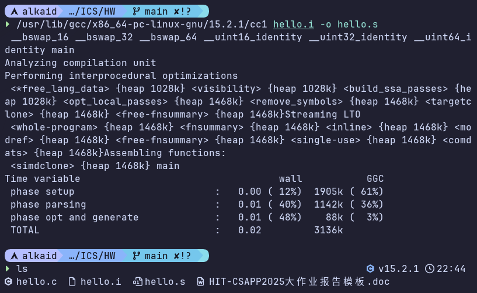

## 3.1 编译的概念和作用

编译是将预处理后的源代码（通常以.i为后缀）转换为汇编代码的过程，编译器会对源代码进行语法分析、语义分析和优化，生成对应的汇编代码文件（通常以.s为后缀）

编译的主要作用包括：

1. 语法检查：确保源代码符合C语言的语法规则
2. 语义分析：检查代码的语义正确性，如类型检查、变量作用域等
3. 代码优化：对代码进行优化，提高执行效率
4. 生成汇编代码：将高层次的C代码转换为低层次的汇编代码

## 3.2 编译命令

```shell
/usr/lib/gcc/x86_64-pc-linux-gnu/15.2.1/cc1 hello.i -o hello.s
```



## 3.3 Hello的编译结果解析

### 3.3.1 基本数据类型

在hello.s中，主要涉及的C数据类型包括：

- `int`：用于argc、循环变量i和返回值，编译器将其存储为32位有符号整数，使用`movl`指令操作
- `char **`：用于argv参数，表示字符串数组的指针，编译器将其作为64位指针处理，使用`movq`指令

编译器通过x86-64 ABI约定处理这些类型：整数通过寄存器（如%edi, %rsi）传递，指针也通过64位寄存器

### 3.3.2 变量

#### 局部变量

```assembly wrap=false
    movl    $0, -4(%rbp)
    movl    %edi, -8(%rbp)
    movq    %rsi, -16(%rbp)
    movl    $0, -20(%rbp)
```

- 局部变量存储在栈上，相对于%rbp的偏移量：
  - `-4(%rbp)`：返回值（`int`）
  - `-8(%rbp)`：`argc`（`int`）
  - `-16(%rbp)`：`argv`（`char **`）
  - `-20(%rbp)`：循环变量`i`（`int`）
- 编译器为每个局部变量分配固定栈偏移，确保变量在函数执行期间保持位置。

#### 参数传递

- `argc`通过`%edi`寄存器传递，保存到`-8(%rbp)`
- `argv`通过`%rsi`寄存器传递，保存到`-16(%rbp)`
- 这遵循x86-64 System V ABI的参数传递约定。

### 3.3.3 表达式和运算符

#### 赋值操作 (=)

```assembly wrap=false
    movl    $0, -4(%rbp)
    movl    %edi, -8(%rbp)
    movq    %rsi, -16(%rbp)
    movl    $0, -20(%rbp)
```

- 使用`movl`（32位）和`movq`（64位）指令实现赋值
- 立即数赋值如`movl $0, -4(%rbp)`
- 寄存器到内存赋值如`movl %edi, -8(%rbp)`

#### 关系操作 (==, >=)

```assembly wrap=false
    cmpl    $5, -8(%rbp)
    je    .LBB0_2
    cmpl    $10, -20(%rbp)
    jge    .LBB0_6
```

- `cmpl`指令比较两个32位值
- `je`：等于跳转（if argc == 5）
- `jge`：大于等于跳转（if i >= 10）
- 编译器将关系操作转换为条件跳转指令

#### 算术操作 (+)

```assembly wrap=false
    movl    -20(%rbp), %eax
    addl    $1, %eax
    movl    %eax, -20(%rbp)
```

- `i++`操作通过`addl $1, %eax`实现
- 先加载变量到寄存器，执行加法，然后写回内存

### 3.3.4 数组和指针操作

#### 数组访问 (A[i])

```assembly wrap=false
    movq    -16(%rbp), %rax
    movq    8(%rax), %rsi
    movq    16(%rax), %rdx
    movq    24(%rax), %rcx
```

- `argv`是`char **`，每个元素是8字节指针
- `argv[1]`对应`8(%rax)`（基址+8）
- `argv[2]`对应`16(%rax)`（基址+16）
- `argv[3]`对应`24(%rax)`（基址+24）
- `argv[4]`对应`32(%rax)`（基址+32）
- 编译器计算偏移量：索引 `*` sizeof(char*) = i `*` 8

### 3.3.5 控制转移

#### if/else 语句

```assembly wrap=false
    cmpl    $5, -8(%rbp)
    je    .LBB0_2
# %bb.1:
    ... // else分支：调用printf和exit
.LBB0_2:
    ... // if分支：继续执行
```

- 条件判断后使用`je`跳转到else分支
- 编译器将if/else转换为条件跳转和基本块

#### for 循环

```assembly wrap=false
.LBB0_3:                                # 循环头
    cmpl    $10, -20(%rbp)
    jge    .LBB0_6                    # 退出条件
# %bb.4:                                # 循环体
    ...
# %bb.5:                                # 循环尾
    movl    -20(%rbp), %eax
    addl    $1, %eax
    movl    %eax, -20(%rbp)
    jmp    .LBB0_3                     # 回到循环头
.LBB0_6:                                # 循环后
```

- 循环条件在循环头检查
- 循环体执行后更新变量并无条件跳转回头
- 编译器生成结构化的基本块来实现循环控制

### 3.3.6 函数操作

#### 函数调用

```assembly wrap=false
    callq    printf
    callq    exit
    callq    atoi
    callq    sleep
    callq    getchar
```

- 使用`callq`指令调用函数
- 返回值通过%rax寄存器接收

#### 函数参数传递

- printf调用：参数通过寄存器传递
  - %rdi：格式字符串
  - %rsi, %rdx, %rcx：可变参数（argv[1], argv[2], argv[3]）
- atoi调用：%rdi传递字符串参数
- sleep调用：%edi传递int参数
- exit调用：%edi传递退出码

#### 函数返回

```assembly wrap=false
    xorl    %eax, %eax
    addq    $32, %rsp
    popq    %rbp
    retq
```

- `xorl %eax, %eax`：设置返回值0
- 恢复栈帧：释放局部变量空间，恢复%rbp
- `retq`：返回到调用者

### 3.3.7 常量

#### 字符串常量

```assembly wrap=false
.L.str:
    .asciz    "\347\224\250\346\263\225: Hello \345\255\246\345\217\267 \345\247\223\345\220\215 \346\211\213\346\234\272\345\217\267 \347\247\222\346\225\260\357\274\201\n"
.L.str.1:
    .asciz    "Hello %s %s %s\n"
```

- 字符串常量存储在.rodata段
- 使用`.asciz`指令定义以null结尾的字符串
- 编译器为每个字符串常量生成唯一的标签

#### 整数常量

```assembly wrap=false
    cmpl    $5, -8(%rbp)
    cmpl    $10, -20(%rbp)
    addl    $1, %eax
    movl    $1, %edi
```

- 立即数直接嵌入指令中
- 编译器在编译时将常量值编码到机器码

## 3.4 本章小结

本章详细解析了hello程序的汇编代码，涵盖了基本数据类型、变量、表达式、数组和指针操作、控制转移、函数调用及常量等方面

通过对汇编指令的分析，理解了C代码如何被编译器转换为低级指令
