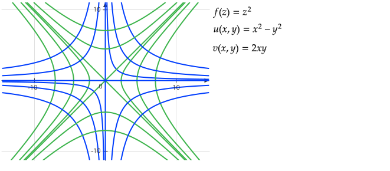

---
title: "[工科复变函数] 调和函数"
published: 2025-09-26 21:00:00
tags: [复变函数,数学]
category: 复变函数
---

## 拉普拉斯方程

$$
\begin{aligned}
\frac{\partial^2 u}{\partial x^2} + \frac{\partial^2 u}{\partial y^2} = 0
\\
\frac{\partial^2 v}{\partial x^2} + \frac{\partial^2 v}{\partial y^2} = 0
\end{aligned}
$$

用Nabla算子$\nabla^2$或拉普拉斯算子$\Delta$表示

调和函数是满足拉普拉斯方程的函数

$f(z)=u(x,y)+iv(x,y)$

若$u$或$v$满足拉普拉斯方程，则称$u$或$v$为调和函数

### 定理 2.3.1

若$f(z)$在区域$D$内解析，则$u(x,y),v(x,y)$都是$D$内的调和函数

### 定义2.3.2

来自同一个解析函数或满足柯西黎曼条件的调和函数$u$和$v$，$v$称为$u$的**共轭调和函数**

### 共轭调和函数的特点

它们的等值线在交点上永远相互正交

### 定理 2.3.2

$f(z)$在区域$D$内解析$\Leftrightarrow $ 虚部$v(x,y)$是实部$u(x,y)$的共轭调和函数

### 积分求调和函数

由柯西黎曼条件

$$
\begin{aligned}
u^{\prime}_x = v^{\prime}_y \\
u^{\prime}_y = -v^{\prime}_x
\end{aligned}
$$

和全微分

$$
\begin{aligned}
dv = v^{\prime}_x dx + v^{\prime}_y dy \\
du = u^{\prime}_x dx + u^{\prime}_y dy
\end{aligned}
$$

得

$$
\begin{aligned}
v(x,y) = \int -u^{\prime}_y dx + \int u^{\prime}_x dy
\\
u(x,y) = \int v^{\prime}_y dx - \int v^{\prime}_x dy
\end{aligned}
$$

该积分与积分路径无关，所以可以随意选择积分路径
