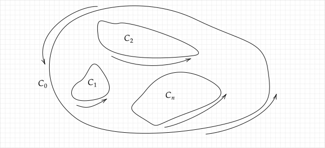
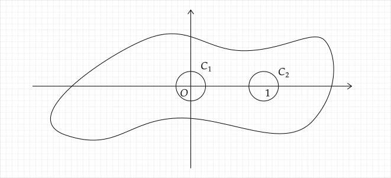

:::warning

本文以及本博客的数学内容主要作为个人笔记，其中包含大量的**个人理解**，本人并非数学专业，对于此类数学课只想以最低的成本拿到满意的分数，因此存在大量不严谨甚至错误的内容，可能造成不适，请谨慎阅读

:::

## 复变函数积分的本质

本质其实是第二型曲线积分

## 计算方法

### 参数方程法

将曲线$C$表示为参数方程$x=x(t),y=y(t),t \in [a,b]$，即$z=z(t)=x(t)+iy(t)$

所以

$$
\begin{aligned}
\int _C f(z)dz &= \int _C f(z(t))dz(t) \\
&= \int _a^b f[z(t)]z^{\prime}(t)dt
\end{aligned}
$$

代入计算即可

## 柯西积分定理（柯西-古萨基本定理）

若$f(z)$在简单光滑闭曲线$C$及其内部**单连通**区域$D$内解析，则

$$
\oint _C f(z)dz=0
$$

（格林公式）

## 定理 3.2.2

单连通区域上的解析函数的积分与路径无关

## 复合闭路定理

若$f(z)$在多连通区域$D$内解析，$D$由$n+1$条闭曲线构成，$C_1,C_2,\cdots,C_n$为$C_0$内的$n$条互不相交的简单光滑闭曲线，且均取正向，则

$$
C = C_0 + C_1^{-} + C_2^{-} + \cdots + C_n^{-}
$$

但我个人更喜欢将闭曲线的积分看作围起来的面积，于是我会这么写

$$
C = C_0 - C_1 - C_2 - \cdots - C_n
$$

$C$是要求的不含奇点的闭曲线

又因为$\oint_C f(z)dz=0$，所以

$$
\oint _{C_0} f(z)dz = \sum_{k=1}^{n} \oint _{C_k} f(z)dz
$$

### 利用复合闭路定理计算含有奇点的积分

计算$\oint_C \frac{dz}{z^2-z}$，$C$是包含单位圆盘的简单闭曲线

被积函数$f(z)=\frac{1}{z^2-z}=\frac{1}{z(z-1)}$有$z_1=0,z_2=1$两个奇点，此外处处解析

在$C$内作正向闭曲线$C_1$和$C_2$，分别围住奇点$z_1,z_2$，由复合闭路定理得

$$
\begin{aligned}
\oint _C \frac{dz}{z^2-z} &= \oint _{C_1} \frac{dz}{z^2-z} + \oint _{C_2} \frac{dz}{z^2-z} \\
&\text{目前只要明白这行即可，后续步骤需要用到柯西积分公式}\\
&= \oint_{C_1} \frac{dz}{z-1} - \oint_{C_1} \frac{dz}{z} + \oint_{C_2} \frac{dz}{z} - \oint_{C_2} \frac{dz}{z-1} \\
&= 0 -2\pi i + 2\pi i - 0 \\
&= 0
\end{aligned}
$$

这里的$C$放在上面的[复合闭路定理](#复合闭路定理)里其实是$C_0$

## 柯西积分公式

函数$f(z)$在闭路$C$及其内部$D$内解析，$z_0$为$D$内任意一点，则

$$
f(z_0) = \frac{1}{2\pi i} \oint _C \frac{f(z)}{z-z_0} dz
$$

:::tip

柯西积分公式多用于求奇点处的积分值，如例题[利用复合闭路定理计算含有奇点的积分](#利用复合闭路定理计算含有奇点的积分)

:::

:::caution

注意分母自带负号，不要搞错$z_0$的正负

:::

## 高阶导数柯西积分公式

$$
f^{(n)}(z_0) = \frac{n!}{2\pi i} \oint _C \frac{f(z)}{(z-z_0)^{n+1}} dz
$$

:::tip

利用这个公式可以直接计算高阶导数

:::

还可以得到一个结论

$$
\int _C \frac{1}{(z-z_0)^n}dz=\begin{cases}
2\pi i,&n=1 \\
0,&n \ne 1 \text{的整数}
\end{cases}
$$

## 由柯西积分公式得出的重要推论

### 平均值公式

解析函数$f(z)$在圆心的值等于该圆周上函数值的平均值

$z_0$为圆心，$R$为半径

$z=z_0+Re^{i\theta}, dz=Rie^{i\theta}d\theta$

$$
f(z_0) = \frac{1}{2\pi} \int _0^{2\pi} f(z_0 + Re^{i\theta}) d\theta
$$

### 柯西不等式

$M$为$|f(z)|$在闭圆$|z-z_0|=R$上的最大值

$$
|f^{(n)}(z_0)| \leq \frac{n!M}{R^n}
$$

### 代数学基本定理

任何一个复系数多项式

$$
f(z) = a_0 z^n + a_{1} z^{n-1} + \cdots + a_{n-1} z + a_n \quad (a_0 \ne 0, n \ge 1)
$$

$f(z)=0$必有根

### 莫雷拉定理

若$f(z)$是区域$D$内的连续函数，且对于$D$内任意一条简单光滑闭曲线$C$，都有

$$
\oint _C f(z) dz = 0
$$

则$f(z)$在$D$内解析

:::tip

其实就是柯西-古萨基本定理的逆命题

:::

### 泊松公式

任何一个在圆内调和且在闭圆盘上的调和函数，其在园内的值可由圆周上的值的积分表示

$$
u(z_0) = u(r,\theta) = \frac{1}{2\pi} \int _0^{2\pi} \frac{R^2 - r^2}{R^2 - 2Rr\cos(\theta - \varphi) + r^2} u(Re^{i\theta}) d\theta
$$

当$z = z_0$即$r=0$时，退化为平均值公式
