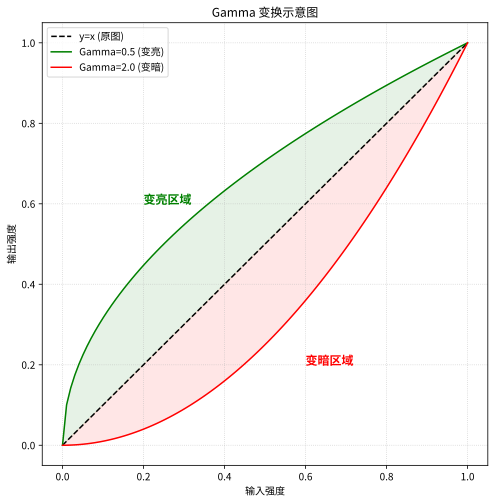
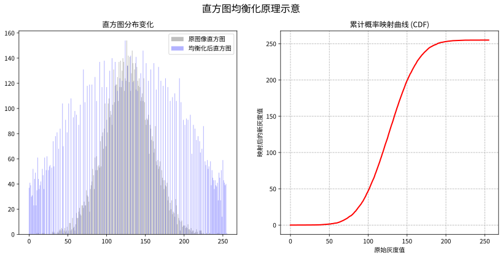

## 线性拉伸

线性拉伸将图中每一个像素的灰度值线性映射到$[x_{\text{min}}, x_{\text{max}}]$之间

$$
g(x, y) = \frac{f(x, y) - f_{\text{min}}}{f_{\text{max}} - f_{\text{min}}} \times (x_{\text{max}} - x_{\text{min}}) + x_{\text{min}}
$$

$f_{\text{min}}$和$f_{\text{max}}$分别是图像中像素灰度值的最小值和最大值

## $\gamma$变换

$\gamma$变换将图中每一个像素的灰度值非线性映射到$[0, 255]$之间

$$
g(x, y) = 255 \times \left( \frac{f(x, y)}{255} \right)^{\gamma}
$$

除255的操作是在进行归一化

其中$\gamma$是一个正数，控制了映射的非线性程度，当$\gamma < 1$时，图像会变亮；当$\gamma > 1$时，图像会变暗；当$\gamma = 1$时，图像保持不变

## 直方图均衡化

直方图均衡化是一种增强图像对比度的方法，通过将图像的灰度值重新分布，使得图像的灰度值在整个范围内均匀分布

计算方式是通过累计概率

将图像统计为直方图，横轴为灰度值，纵轴为是该灰度值的像素数量

当前处理的灰度值为$i$，则累计概率为

$$
s(i) = \sum_{j=0}^{i} \frac{n_j}{n}
$$

$n_j$是灰度值为$j$的像素数量，$n$是图像中像素的总数量

累计概率$s(i)$表示灰度值小于等于$i$的像素占总像素的比例

将累计概率乘以最大灰度值255，得到对应$i$的像素的新灰度值

