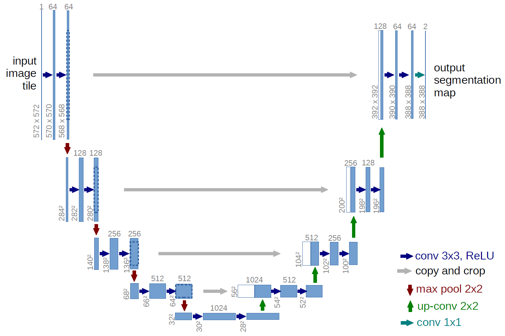

## LeNet-5

- 使用**平均池化**，激活函数为Tanh或Sigmoid
- 7层网络（3卷积 + 2池化 + 1全连接 + 1输出）
- 局限性：梯度消失问题，网络变深会导致训练困难

## AlexNet

- 使用**ReLU激活函数**、**最大池化**和**Dropout**
- 8层网络（5卷积 + 3全连接），输入224×224 RGB图像
- FC参数量巨大（~60M），后接3个全连接层（4096+4096+1000）

## ResNet

特点是**跳跃连接**，不再让每层直接输出结果，而是输出跟结果的差异（残差学习），解决了深层网络的梯度消失问题

### 残差块

每个残差块由 Conv → BN → ReLU → Conv → BN → 跳跃连接相加 → ReLU 组成

- **恒等块(Identity Block)**：输入输出尺寸通道相同，直接相加
- **投影块(Projection Block)**：输入输出尺寸或通道不同，通过1×1卷积调整后相加
- **BasicBlock(ResNet-18/34)**：2层3×3卷积，卷积过程尺寸不变
- **Bottleneck(ResNet-50/101/152)**：1×1降维 → 3×3 → 1×1升维，先降后升减少计算量

避免了AlexNet中FC参数过多的问题

## VGGNet

- 整个网络全用3×3卷积核（堆叠两个3×3等同5×5感受野，堆叠三个等同7×7），全部使用2×2最大池化
- 5个卷积块逐步增加通道数（64→128→256→512→512），后接3个全连接层
- 缺点：参数量巨大（FC层占大多数）

## GoogLeNet (Inception系列)

特点是使用**Inception模块**，在同一层中使用不同大小的卷积核并行提取多尺度特征，最后拼接

### Inception模块(降维版)

4条并行支路均先经过1×1卷积降维，再分别进行不同操作：① 1×1直接输出；② 1×1 + 3×3；③ 1×1 + 5×5；④ 3×3池化 + 1×1。通过padding使各支路输出尺寸相同

使用**全局平均池化**替代全连接层大幅减少参数量；引入辅助分类器缓解梯度消失

### Inception-V2

> 引入**批归一化(BN)**，不再使用Dropout

- 将5×5卷积替换为**两个3×3卷积串联**，感受野不变但参数量减少
- 提出**BN+Inception**的组合，加速收敛并起到正则化效果
- 辅助分类器也加入了BN

### Inception-V3

> 进一步分解大卷积核，引入**非对称卷积**和**标签平滑**

- **卷积分解**：
  - 将3×3分解为**1×3 + 3×1**（非对称卷积），进一步减少参数量
  - n×n卷积分解为1×n + n×1，参数量从O(n²)降至O(n)
- **辅助分类器**中加入BN
- **标签平滑(Label Smoothing)**：将硬目标(0/1)替换为平滑分布(如$\epsilon/(K-1)$)，减少过拟合
- 输入尺寸从224×224调整为**299×299**

### Inception-V4

> 与残差连接结合的Inception-ResNet，以及纯Inception的V4版本

- **Inception-ResNet**：在Inception模块中引入**残差连接**(跳跃连接 + 逐元素相加)，解决超深Inception的训练困难
- Inception-V4：纯Inception结构（无残差连接），但设计更规整、更深
- 引入**Reduction Block**专门控制特征图尺寸缩减

## U-Net

编码器-解码器对称结构，编码器负责下采样，解码器负责上采样，架构形似“U”形+跳跃连接

U-Net的跳跃连接是通道拼接，而非ResNet的逐元素相加

## DenseNet

每层接受前面所有层的输出作为输入，输出也会传递给后续所有层，形成密集连接

跳跃连接同样是通道拼接，而非ResNet的逐元素相加

## ZFNet(ZeilerNet)

> 2013年ILSVRC冠军，对AlexNet的可视化分析与改进

- **核心贡献**：提出**反卷积(Deconvolution)**方法可视化中间层特征，解释CNN每层学到了什么
- 与AlexNet结构基本相同，仅调整了超参数：
  - Conv1：从11×11步长4改为**7×7步长2**，保留更多低频信息
  - Conv3/4/5：增加卷积核数量
- **意义**：打开了CNN"黑盒"，证明了深层特征更具语义性、对平移和缩放更鲁棒

## VGG-VD(Very Deep VGG)

> VGG的极深变体（VGG-16/VGG-19），相比原始VGG加深至16~19层

- 延续VGG风格：**全部使用3×3卷积 + 2×2最大池化**
- 通过堆叠更多3×3卷积层增加深度，同时保持感受野不变
- 参数量集中在全连接层，后接3个全连接层（4096+4096+1000）

## 空洞卷积(Dilated/Atrous Convolution)

> 在卷积核元素之间插入空洞（间隔），**在不增加参数量的情况下扩大感受野**

$$
\text{输出尺寸} = \left\lfloor \frac{\text{输入尺寸} + 2p - d(k-1) - 1}{s} + 1 \right\rfloor
$$

- $d$：空洞率(dilation rate)，普通卷积$d=1$，$d=2$时感受野等同5×5卷积但仍是3×3的参数
- **优点**：可控制特征图的分辨率（不降采样也能扩大感受野），适合语义分割等密集预测任务
- **典型应用**：DeepLab系列语义分割网络

## 形变卷积(Deformable Convolution)

> 卷积核的每个采样点学习一个**偏移量(offset)**，使卷积核形状自适应目标几何形变

- 标准卷积在固定网格(如3×3规则网格)上采样；形变卷积在每个位置额外学习$2k^2$个偏移量
- 偏移量由另一个平行卷积层从输入特征图中学习得到
- **特点**：对目标尺度、姿态、形变更鲁棒，适合物体检测和语义分割

## 近似恒等映射(Approximate Identity Mapping)

> ResNet的核心思想：让堆叠层拟合**残差**$F(\mathbf{x}) = H(\mathbf{x}) - \mathbf{x}$，而非直接拟合$H(\mathbf{x})$

$$
H(\mathbf{x}) = F(\mathbf{x}) + \mathbf{x}
$$

- 若恒等映射$H(\mathbf{x}) = \mathbf{x}$是最优的，残差块只需将$F(\mathbf{x})$逼近0（比拟合复杂映射更容易）
- 保证了深层的梯度可以直接通过跳跃连接回传，缓解梯度消失

## 类激活图(CAM)

> 通过全局平均池化层的权重，生成**类别响应的热力图**，定位图像中判别性区域

- 结构：CNN特征提取 → 全局平均池化 → 全连接(softmax)
- 对最后一层卷积特征图$\mathbf{f}_k$（第$k$个通道）加权求和：$M_c(x,y) = \sum_k w_k^c \cdot \mathbf{f}_k(x,y)$
- $w_k^c$是类别$c$对应第$k$个特征图的权重，热力图高亮区域即为分类依据区域
- **局限**：需修改网络结构（将全连接替换为全局平均池化）

## 空域注意力(Spatial Attention)

> 关注"**哪里**"是重要区域，生成空间维度的注意力权重图

- 对特征图$\mathbf{X} \in \mathbb{R}^{C \times H \times W}$，通过卷积或池化生成空间权重$\mathbf{M}_s \in \mathbb{R}^{1 \times H \times W}$
- 每个空间位置$(i,j)$获得一个权重值，表示该位置的重要性
- 权重与原始特征逐元素相乘：$\mathbf{X}' = \mathbf{X} \odot \mathbf{M}_s$

## 通道注意力(Channel Attention)

> 关注"**什么**"是重要的特征通道，生成通道维度的权重向量

- 典型代表：**SENet(Squeeze-and-Excitation Network)**
  - **Squeeze**：全局平均池化将$C \times H \times W$压缩为$C \times 1 \times 1$
  - **Excitation**：通过两个全连接层（降维→升维）学习通道间依赖，经Sigmoid输出0~1权重
  - **Scale**：权重与原始特征图逐通道相乘
- 每个通道获得一个标量权重，表示该通道的重要性
- 计算开销小，可嵌入任意网络

## CBAM(Convolutional Block Attention Module)

> **通道注意力 + 空域注意力**串联，兼顾"什么"和"哪里"

1. **通道注意力模块**：先对特征图进行全局平均池化和全局最大池化，经共享MLP后相加，经Sigmoid得到通道权重
2. **空域注意力模块**：沿通道维度进行平均池化和最大池化，拼接后经7×7卷积 + Sigmoid得到空间权重
3. 两模块串联：特征 → 通道注意力 → 空域注意力 → 输出

**特点**：轻量级即插即用模块，在分类和检测任务上均有效提升性能

## ECANet(Efficient Channel Attention Network)

> 对SENet的改进，用**一维卷积**替代全连接层，实现更高效的通道注意力

- 去掉了SENet中的降维操作（全连接），直接通过**一维卷积**捕捉局部跨通道交互
- 卷积核大小$k$由通道数$C$自适应决定：$k = \psi(C) = \left|\frac{\log_2 C}{\gamma} + \frac{b}{\gamma}\right|_{\text{odd}}$
- **特点**：参数极少（仅$k$个参数），计算效率高，性能优于SENet
