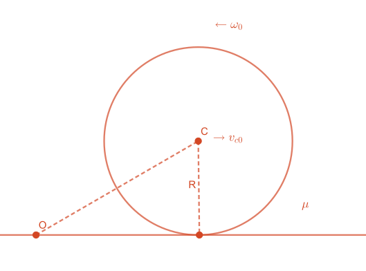

## 例题

半径为$R$的球，绕质心轴的转动惯量$J=\frac{2}{3}mR^2$（$m$为球的质量），在粗糙水平面上运动，开始时球质心速度为$v_{c0}$，初角速度为$\omega_0$，方向如图所示（垂直纸面向外），摩擦系数$\mu$，求球到开始纯滚动所需的时间及纯滚动时质心的速度

~~选这个奇怪的颜色是因为无论黑白模式都能看清~~

解：

在平面上取一点$O$作为角动量的参考点，因为摩擦力方向与水平面平行，过$O$点，因此摩擦力矩为0，重力矩球的合外力矩为0，关于$O$点角动量守恒

> [!TIP]
>
> ### 重要结论
>
> 球对参考点$O$的角动量等于对点$O$的质心角动量（公转的角动量）和绕质心轴的角动量（自传的角动量）的矢量和
>
> 因此开始时角动量为$mRv_{c0}-J\omega_0$，（注意$\omega_0\text{和}Rv_{c0}$的方向相反，所以要加负号，取垂直纸面向里为正方向

> [!NOTE]
>
> ### 纯滚动条件
>
> 表面线速度等于角速度叉乘半径 $v=\omega \times R$
>
> 表面线速度等于球质心速度 $v=v_c$

因此：开始纯滚动时角动量为$mRv_c+J\omega$

$$
\begin{aligned}
mRv_{c0}-J\omega_0 &= mRv_c + J\omega &\text{ 角动量守恒}  \\
v_c-v_{c0} = - \frac{J}{mR} ( \omega_0 + \omega ) &= -\frac{2}{3}R ( \omega_0 + \omega ) &\text{ 速度改变量} \\
v_c&=R\omega &\text{ 纯滚动条件}
\end{aligned}
$$

可解得
$$
v_c=\frac{3}{5}v_{c0}-\frac{2}{5}R\omega_0
$$

摩擦加速度$\mu g$

$$
\begin{aligned}
v_c &= v_{c0}-\mu g t \\
t&=\frac{2}{5} \frac{v_{c0} + R \omega_0}{\mu g}
\end{aligned}
$$
