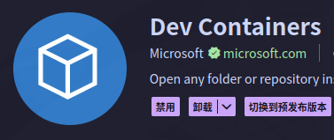

## 需要的工具

安装`distrobox`和`podman`（`docker`也可以，但是我觉得`podman`比较轻量）

## 生成nvidia的cdi配置（不需要独显可以跳过）

先安装`nvdia-container-toolkit`

```bash
sudo nvidia-ctk cdi generate --output=/etc/cdi/nvidia.yaml
sudo nvidia-ctk runtime configure --runtime=docker #虽说这里是docker但是podman也得用

# 如果用docker还需要重启docker服务
sudo systemctl restart docker
```

`nvidia-ctk cdi generate --output=/etc/cdi/nvidia.yaml`这行命令貌似每次更新nvidia驱动都需要执行一次，nvidia的文档里也有自动生成的办法，不过更新也不频繁我觉得手动就行了

## 创建容器

```bash
distrobox create --name <实例名称> --additional-flags "--device nvidia.com/gpu=all" --image docker.io/nvidia/cuda:12.9.1-cudnn-runtime-ubuntu22.04
```

这里就用nvidia的带cudnn-runtime的镜像了，如果你不需要可以直接用ubuntu的官方镜像

如果不需要nvidia独显，无需添加`--additional-flags "--device nvidia.com/gpu=all"`

:::tip
如果担心容器和宿主机共享home会污染环境，可以用`--home /path`指定容器home的位置，而且这个只是用户目录本身，Documents目录等仍然会映射到宿主机对应位置
:::

:::warning
使用nvidia的镜像时会弹广告，这个广告内容会被旧版的`distrobox`当成命令执行导致报错，所以记得更新`distrobox`到最新版
:::

:::tip
至于为什么不用`distrobox`的`--nvidia`参数启用nvidia独显，因为它会把宿主机的`libicudata`挂载进容器，导致容器中无法安装`libicu-dev`
:::

## 进入容器

```bash
distrobox enter <实例名称>
```

之后像正常使用Ubuntu一样安装ROS就好了

## VsCode连接容器进行开发

无需在容器中安装vscode

### 安装插件

在宿主机的vscode中安装`Dev Containers`插件



### 修改设置

打开vscode设置->扩展->开发容器

- `dev.containers.dockerPath`值改为`podman`（如果你用的是docker就不用改）
- `dev.containers.dockerSocketPath`值改为`/var/run/podman.sock`

### 连接容器

点击vscode左下角远程图标->附加到正在运行的容器（提前`distrobox enter`）

### 用户设置

默认进入容器后是以UID 10000作为用户，会导致在宿主机上无法直接操作vscode创建的文件夹，可以在连接容器的配置中指定用户名

连接到容器后，按`Ctrl+Shift+P`，找到`Dev Containers: Open Attached Container Configuration File`，选择打开对应的配置文件（应该就一个，没得选），添加内容

```json
"remoteUser": "<宿主机用户名>"
```

### 连接容器时启用ROS环境

按照这项修改后vscode中的clangd和cmake即可正常找到ROS相关的头文件和库

修改容器使用的shell对应的rc文件（`~/.bashrc`，`~/.zshrc`等），在最后添加

> 当然得是容器实际使用的rc文件，如果你在创建容器时用`--home /path`指定了其他位置作为容器的home的话就得是`/path`下的

```bash
source /opt/ros/<ros版本>/setup.<shell类型>
```

## 常见问题

### `dpkg`报错`xserver-*`无法安装

类似于

```plaintext
 dpkg: error processing package xserver-xorg-input-all (--configure):

 dependency problems - leaving unconfigured

Errors were encountered while processing:

 keyboard-configuration

 xserver-xorg-core

 xserver-xorg-video-ati

 xserver-xorg-video-radeon

 xserver-xorg-input-wacom

 xserver-xorg-video-fbdev

 xserver-xorg-video-vmware

 xserver-xorg-video-intel

 xserver-xorg-video-all

 xserver-xorg-video-vesa

 xserver-xorg-video-qxl

 xserver-xorg-video-amdgpu

 xserver-xorg

 xserver-xorg-video-nouveau

 xserver-xorg-input-libinput

 xserver-xorg-input-all

E: Sub-process /usr/bin/dpkg returned an error code (1) 
```

这个问题应该只会出现在安装ROS1的desktop-full时，因为是容器所以用不上这些包，就算要在容器里显示图形界面软件也用不上，可以直接移除掉

```bash
sudo apt remove --purge xserver-xorg-core
sudo apt autoremove
```

### 每次使用`apt`都有未设置语言环境的警告

先用`apt`安个编辑器`vim`,`nano`之类的都可以

```bash
sudo vim /etc/locale.gen
```

将`en_US.UTF-8 UTF-8`和`zh_CN.UTF-8 UTF-8`取消注释

```bash
sudo locale-gen
```

### 容器内的图形软件不用独显渲染

这个其实不是容器的问题，在哪都一样

需要在运行软件前设置环境变量

```bash
__NV_PRIME_RENDER_OFFLOAD=1 __VK_LAYER_NV_optimus=NVIDIA_only __GLX_VENDOR_LIBRARY_NAME=nvidia <命令>
```

为了方便可以在`~/.bashrc`或者`~/.zshrc`之类的里面加个别名（取决于你用什么shell）

```bash
alias prime-run='__NV_PRIME_RENDER_OFFLOAD=1 __VK_LAYER_NV_optimus=NVIDIA_only __GLX_VENDOR_LIBRARY_NAME=nvidia '
```

之后直接用`prime-run <命令>`就行
